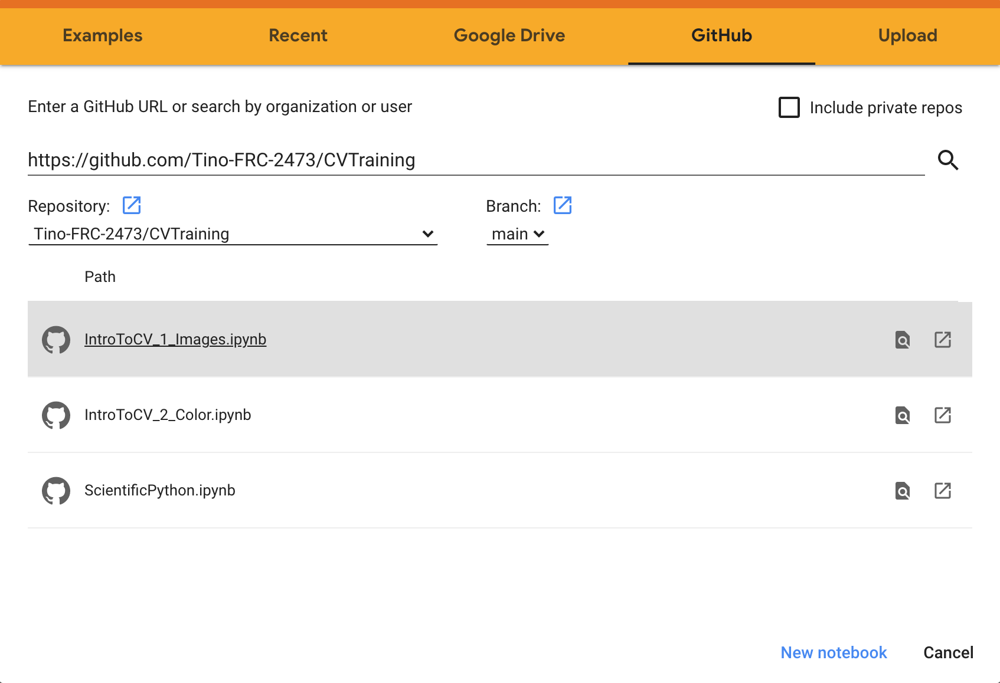

# Offseason Training

This repo contains the resources and iPython notebooks for 2020 Offseason training.

# Opening in Google Colab

These trainings are contained in iPython notebooks. You can use them from your browser via Google Colab.

1. Open Colab (https://colab.research.google.com)
2. Select GitHub as the source for find notebooks
3. Enter the URL for this repo https://github.com/Tino-FRC-2473/2020OffseasonTraining
4. Click the notebook you want to open.

